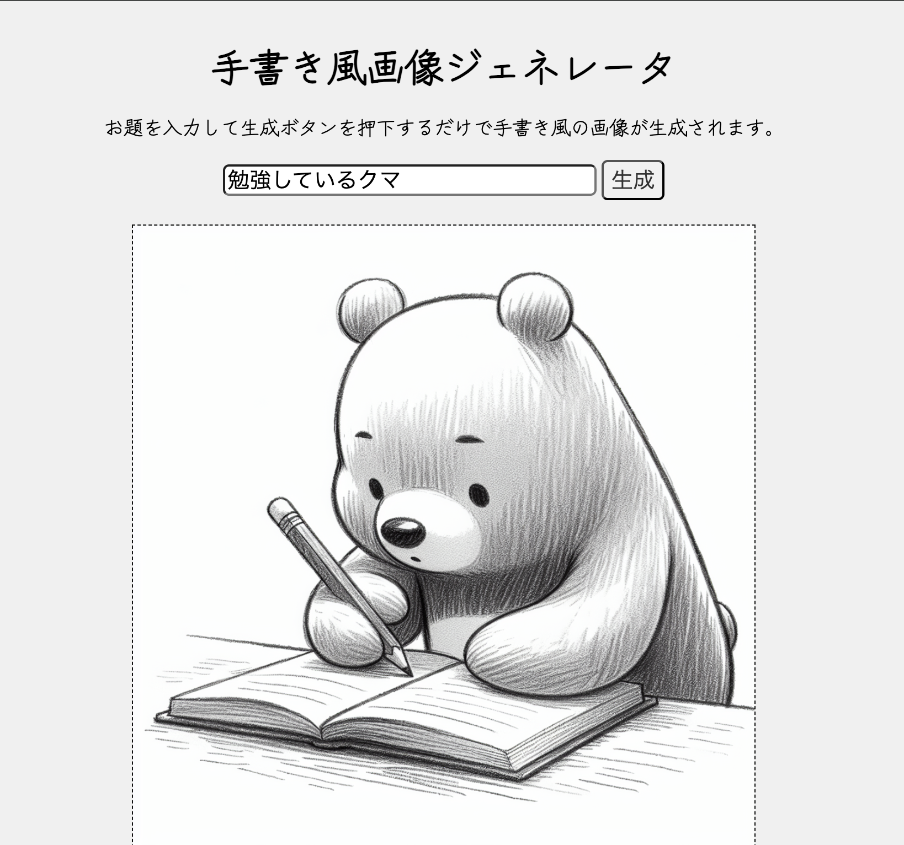

# 手書き風画像ジェネレータ

## 概要
お題を入力して送信すると手書き風の画像を生成してくれます。


## 技術
### スタック
- **Golang**
  - **Gin**
- **HTML/CSS**
- **JavaScript**

### 内容
バックエンドは、静的HTMLを返すGETメソッドと生成された画像URLを返すPOSTメソッドの2つで構成されています。
画像生成には、GPTのDALL-E 3モデルを使用しています。

## 起動方法
### Docker
```shell
docker build -t image-gen .
docker run -p 8080:8080 image-gen
```
### Golang
```
go run main.go clientGpt.go
```