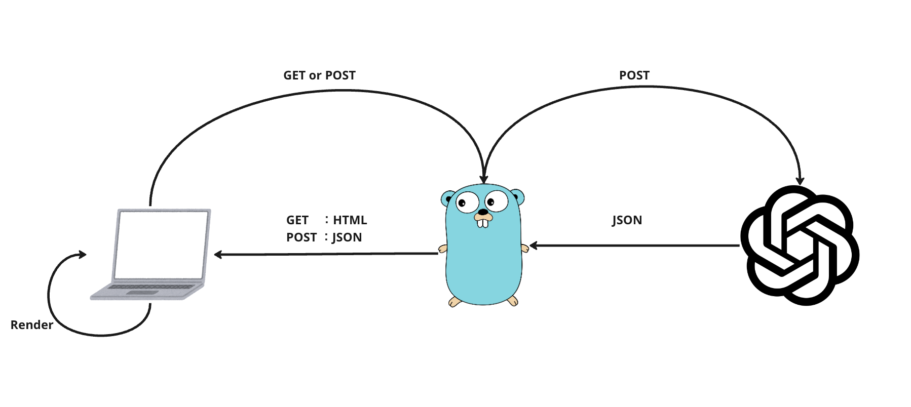

# 手書き風画像ジェネレータ

## 概要
お題を入力して送信すると手書き風の画像を生成してくれます。


## 技術
### 選定
#### Frontend
[](https://skillicons.dev)
#### Backend
[](https://skillicons.dev)

### 内容
#### 設計
バックエンドは、静的HTMLを返すGETメソッドと生成された画像URLを返すPOSTメソッドの2つで構成されています。
画像生成には、GPTのDALL-E 3モデルを使用しています。

#### 環境変数
このプロジェクトでは２つの環境変数を使用しています。
- OPEN_AI_SECRET
  - OpenAI Apiを使用するためのApiKeyを格納しています。各自用意が必要になります。 
- BASE_PROMPT
  - ベースとなるプロンプトを格納しています。ユーザが送信したテキストと結合させてOpenAI Apiにリクエストを送信することでユーザが意識しなくてもコンセプトにあったレスポンスを返せるようになります。


## 起動方法
### Docker
```shell
docker build -t image-gen .
docker run -p 8080:8080 image-gen
```
### Golang
```
go run main.go clientGpt.go
```